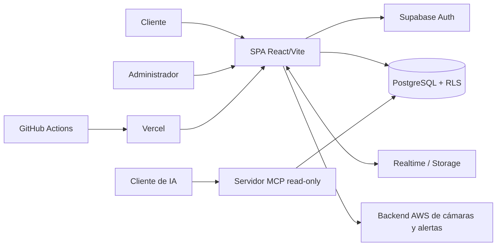

# SecureHome IoT — entrega técnica fase III

**Estudiante:** Carrion Calo  
**Actividad:** Proyecto final — Fase III  
**Proyecto:** SecureHome IoT

## 1. Problema, alcance y arquitectura

SecureHome IoT centraliza la contratación, instalación y supervisión de seguridad
residencial. El MVP cubre dos actores: el cliente registra una solicitud, agenda la
instalación, conversa con soporte y consulta sus cámaras; el administrador gestiona
clientes, solicitudes, citas, cámaras y accesos temporales.

| Componente | Responsabilidad | Criterio de integración |
|---|---|---|
| React/Vite | Interfaz, validación y navegación por rol | Usa la clave pública `anon`; nunca contiene `service_role` |
| Supabase Auth | Sesión, OAuth, confirmación y recuperación | JWT identifica a `auth.uid()` en PostgreSQL |
| PostgreSQL/RLS | Datos, reglas de propiedad y funciones administrativas | RLS es la frontera de autorización real |
| Realtime/Storage | Chat, notificaciones e imágenes | Acceso sujeto a sesión y políticas |
| Backend AWS | Streams MJPEG y alertas de detección | URL asignada a una solicitud; cooldown de alertas |
| MCP | Consultas operativas para IA | Cuenta separada, sólo `SELECT`, límite máximo de 100 registros |
| Vercel/GitHub Actions | Hosting y control de calidad | despliegue tras lint/build correcto |

Fuera del alcance actual quedan la alta disponibilidad del backend AWS, el firmware,
la conexión definitiva de sirenas/NFC y una aplicación móvil nativa.

## 2. Backend y contratos

El backend de negocio es Supabase (PostgREST, RPC, Auth, Realtime y Storage). Los
archivos `supabase_*.sql` son migraciones reproducibles de tablas, restricciones,
políticas y funciones. El contrato principal se expresa mediante:

- recursos `service_requests`, `appointments`, `service_messages`, `camera_devices`,
  `residents`, `pets` y `camera_design_selections`;
- restricciones SQL para estados, roles e integridad referencial;
- funciones RPC para operaciones privilegiadas de administración y acceso temporal;
- herramientas MCP `list-clients`, `get-security-overview`, `list-cameras` y
  `get-household`, con entradas validadas por Zod (UUID, enumeraciones y límites).

Los errores del MCP se devuelven con `isError: true` y un mensaje operacional. La
evolución compatible añade columnas opcionales o nuevas funciones; un cambio
incompatible deberá publicarse como RPC/herramienta `v2` y mantener `v1` durante la
migración. El servidor MCP declara versión `1.0.0`.

## 3. Seguridad y gobernanza

- Supabase Auth administra contraseñas, OAuth, sesión y verificación de correo.
- `ProtectedRoute` mejora la experiencia, pero la seguridad efectiva reside en RLS.
- Las políticas comprueban propiedad con `auth.uid()` y administración mediante
  `public.is_admin()`; las operaciones sensibles vuelven a validar el rol en SQL.
- El acceso administrativo a cámaras requiere un código y genera una concesión de
  cinco minutos (`camera_access_grants`), aplicando privilegio mínimo temporal.
- El MCP usa una credencial secreta exclusiva fuera del frontend. La migración
  `supabase_mcp_readonly_setup.sql` revoca privilegios y concede sólo lectura.
- GitHub Actions usa `contents: read`; Vercel añade cabeceras de endurecimiento.
- Los cambios y accesos relevantes quedan correlacionados por usuario, solicitud y
  marcas `created_at`/`updated_at`. Una bitácora inmutable es mejora pendiente.

No deben versionarse `.env`, `.env.mcp` ni claves. Si una clave se expone, debe
revocarse en Supabase, sustituirse en Vercel y revisarse el historial Git.

## 4. Rendimiento, integración y resiliencia

- Las consultas seleccionan columnas concretas, filtran por solicitud/estado y
  limitan listados MCP a 100 elementos.
- `get-security-overview` ejecuta cinco consultas independientes con `Promise.all`.
- Realtime evita sondeo continuo del chat; las alertas aplican cooldown.
- Los assets con hash se sirven con caché inmutable de un año desde Vercel.
- El visor contempla reconexión del stream y permite cambiar entre cámaras.

El build actual advierte un chunk JS superior a 500 kB y recursos gráficos grandes.
La siguiente iteración debe incorporar lazy loading por ruta, división explícita del
bundle y conversión de imágenes a WebP/AVIF.

## 5. Observabilidad y operación

Vercel Analytics aporta telemetría básica del frontend. Los estados y errores se
muestran al usuario, mientras que el MCP escribe arranque y fallos en `stderr` sin
contaminar el protocolo `stdout`. GitHub Actions ejecuta instalación limpia, lint y
build en cada push/PR. El despliegue y rollback están definidos en
[`docs/OPERACION.md`](./docs/OPERACION.md), y la evidencia reproducible en
[`docs/EVIDENCIAS.md`](./docs/EVIDENCIAS.md).

## 6. Decisiones, límites y defensa

Supabase reduce el costo de construir identidad, API, persistencia y eventos, pero
genera dependencia del proveedor. RLS fue elegida porque la validación visual por rol
no protege una API. El acceso temporal de cámara equilibra soporte y privacidad. MCP
es deliberadamente de sólo lectura para impedir que un agente ejecute acciones
físicas de alto impacto.

El principal fortalecimiento posterior debe ser observabilidad centralizada:
identificadores de correlación, auditoría append-only, métricas del backend AWS,
alertas de disponibilidad y objetivos SLO. Después deben añadirse pruebas de
integración de RLS sobre una instancia efímera y pruebas E2E de los flujos críticos.

## 7. Trazabilidad de la rúbrica

| Criterio | Evidencia en el repositorio |
|---|---|
| Arquitectura y alcance | Este documento, sección 1; `src/App.jsx` |
| Backend y contratos | `supabase_*.sql`; `mcp/server.js`; sección 2 |
| Seguridad y gobernanza | `ProtectedRoute.jsx`; SQL de RLS/cámaras/MCP; sección 3 |
| Rendimiento e integración | `get-security-overview`; Realtime; `vercel.json`; sección 4 |
| Observabilidad y operación | `.github/workflows/ci.yml`; docs de operación/evidencia |
| Sustentación técnica | Sección 6 |

Commits funcionales identificables incluyen `b9067a2` (hogar), `bc8e7cb`
(términos), `ad8b139` (cámaras), `40a8bc8` (cooldown) y `cfa525f` (control de
visibilidad). Los nuevos cambios deben conservar mensajes atómicos por capacidad.
