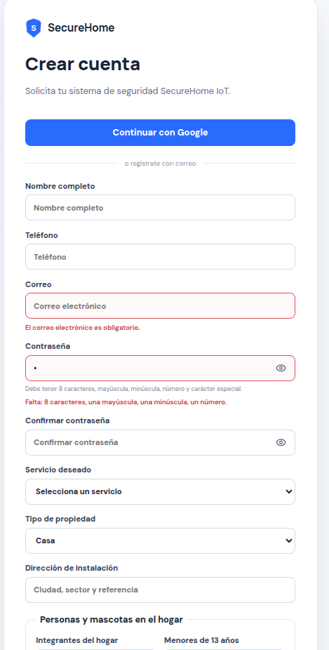
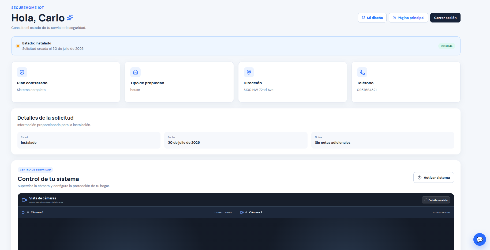
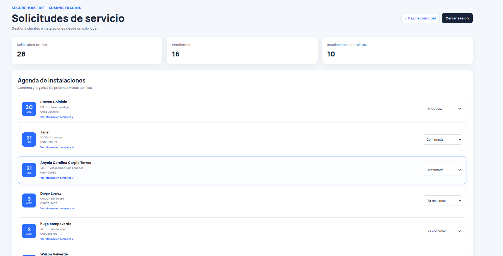
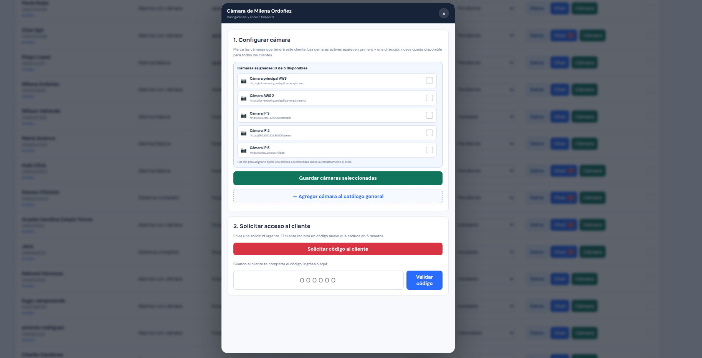

# Evidencias funcionales

## Verificación reproducible local

Entorno verificado el 9 de agosto de 2026 con instalación existente del lockfile:

```text
$ npm run lint
> eslint .
[exit code 0]

$ npm run build
> vite build
✓ 1861 modules transformed.
dist/assets/index-*.css   60.02 kB (gzip 12.35 kB)
dist/assets/index-*.js   684.84 kB (gzip 197.62 kB)
✓ built
[exit code 0]
```

La advertencia de tamaño del chunk está declarada como deuda técnica en el documento
de entrega; no impide el build. Para reproducir desde cero:

```bash
npm ci
npm run lint
npm test
npm run build
```

## Evidencia disponible

- Aplicación desplegada: <https://securehome-iot.vercel.app>
- Pipeline: pestaña **Actions** del repositorio después de publicar este commit; el
  run conserva durante 14 días el artefacto `securehome-iot-<SHA>`.
- Plan CI/CD: [flujo, secretos, liberación, auditoría y rollback](./CI-CD.md).
- Arquitectura visual: `public/infografia-securehome-iot-final.png`.
- SQL verificable: políticas RLS, funciones y concesiones en `supabase_*.sql`.
- Contrato de IA: herramientas con validación Zod en `mcp/server.js`.
- Trazabilidad PE-3.4: [comparación normal frente a fallo](./evidencias/trazabilidad-normal-vs-fallo.txt)
  y [documento de diagnóstico con capturas](./PE-3.4_CarrionCalo_Trazabilidad.md).
- Análisis TA-3.4: [interpretación de señales, acciones y conclusión](./TA-3.4_CarrionCalo_Observabilidad.md).

## Capturas del sistema

Las siguientes evidencias muestran los flujos principales de SecureHome IoT en
funcionamiento.

### 1. Autenticación de usuarios

La pantalla de autenticación permite el ingreso seguro de clientes y
administradores mediante Supabase Auth.

<p align="center">
  
</p>

### 2. Panel del cliente

El cliente puede consultar su servicio, gestionar la información de su hogar y
acceder únicamente a los recursos asociados con su cuenta.

<p align="center">
  
</p>

### 3. Panel de administración

El administrador dispone de una vista centralizada para gestionar clientes,
solicitudes, citas y dispositivos, respetando los controles de acceso definidos.

<p align="center">
  
</p>

### 4. Funcionalidad principal

Esta captura evidencia la operación de uno de los módulos centrales del sistema,
integrado con los servicios backend y las reglas de seguridad del proyecto.

<p align="center">
  
</p>

> **Protección de datos:** las evidencias académicas no deben mostrar contraseñas,
> tokens, teléfonos, direcciones reales ni URL privadas de cámaras.

## Guion de demostración

1. Registrar un cliente y confirmar el correo.
2. Crear una solicitud, seleccionar plan/diseño y agendar una cita válida.
3. Mostrar que el cliente sólo ve su solicitud y cámaras.
4. Ingresar como administrador, cambiar el estado y comprobar el mensaje automático.
5. Solicitar acceso temporal a una cámara y verificar su expiración.
6. Enviar un mensaje con imagen y observar la actualización Realtime.
7. Mostrar el job CI exitoso y los logs de despliegue sin secretos.

Las capturas con cuentas reales deben anonimizar nombre, correo, teléfono, dirección,
tokens y URL de stream antes de incorporarse al informe o presentación.
