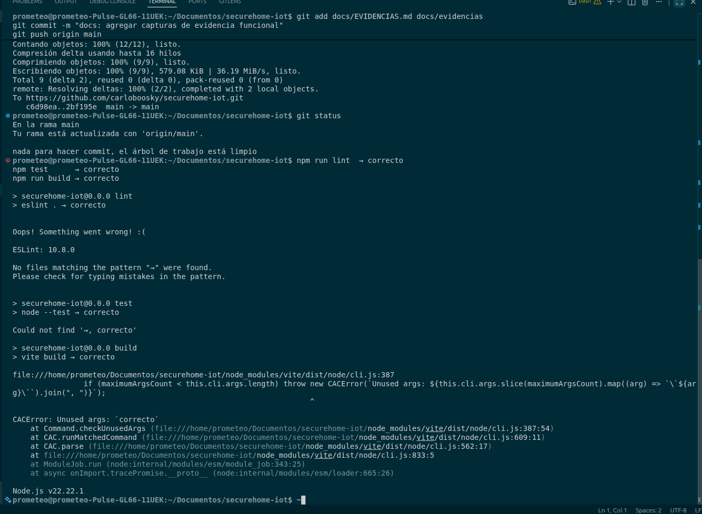
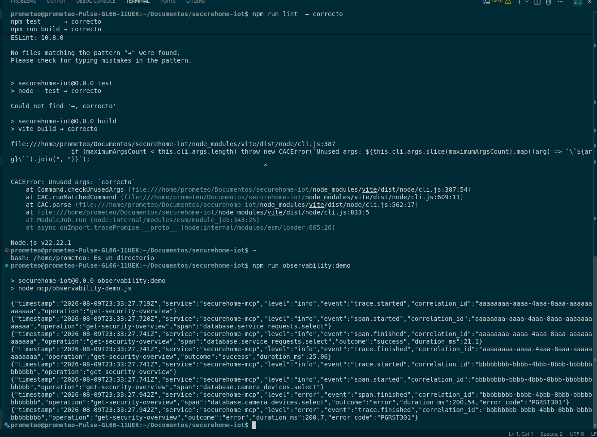

# TA-3.4 — Análisis de observabilidad, trazas y latencias

**Estudiante:** Carrion Calo  
**Actividad:** Trabajo autónomo TA-3.4 — Reporte de trazas y latencias  
**Proyecto:** SecureHome IoT

## 1. Síntesis del caso

Este trabajo profundiza la instrumentación realizada en la práctica
[PE-3.4](./PE-3.4_CarrionCalo_Trazabilidad.md). El flujo seleccionado es la consulta de un
**resumen de seguridad residencial** mediante la herramienta MCP
`get-security-overview`.

```text
Cliente MCP
  → servidor SecureHome MCP
    → Supabase/PostgREST
      → PostgreSQL
         ├── service_requests
         ├── camera_devices
         ├── residents
         ├── pets
         └── camera_design_selections
    ← consolidación del resumen y modo del hogar
  ← respuesta MCP con correlationId
```

La transacción recibe el UUID de una solicitud de servicio, ejecuta cinco consultas
paralelas y devuelve la solicitud, cámaras activas, residentes, mascotas, diseño de
cámara y modo inferido del hogar. Participan, por tanto, el cliente MCP, el servicio
MCP, la API PostgREST de Supabase y PostgreSQL.

## 2. Análisis de las señales observadas

### 2.1 Correlation ID

La primera señal revisada fue `correlation_id`, porque permite separar solicitudes
concurrentes y reconstruir un recorrido completo. En el caso normal todos los
eventos contienen `aaaaaaaa-aaaa-4aaa-8aaa-aaaaaaaaaaaa`; en el caso degradado usan
`bbbbbbbb-bbbb-4bbb-8bbb-bbbbbbbbbbbb`.

La permanencia del mismo identificador desde `trace.started`, pasando por los spans,
hasta `trace.finished` demuestra que las marcas pertenecen a una misma solicitud.
El servidor también devuelve este identificador al cliente, facilitando relacionar
un error visible con los logs internos.

### 2.2 Secuencia de traza y spans

La secuencia esperada es:

1. `trace.started`: el servidor recibió la operación.
2. `span.started`: comenzó una consulta concreta.
3. `span.finished`: la consulta terminó e informa duración y resultado.
4. `trace.finished`: terminó la operación completa.

El campo `span` localiza el componente lógico. Por ejemplo,
`database.camera_devices.select` identifica el acceso a las cámaras, mientras que
`database.service_requests.select` corresponde a la solicitud principal. Esta
granularidad evita atribuir genéricamente toda la demora al servidor MCP.

### 2.3 Latencia

La evidencia controlada registró los siguientes valores:

| Escenario | Span | Latencia del span | Latencia total | Resultado |
|---|---|---:|---:|---|
| Normal | `database.service_requests.select` | 20,34 ms | 24,54 ms | `success` |
| Degradado | `database.camera_devices.select` | 200,51 ms | 200,64 ms | `error` |

El caso degradado tardó aproximadamente **9,9 veces** más en el span observado que
el caso normal. Además, en el escenario degradado casi toda la duración total
corresponde al acceso a cámaras: 200,51 de 200,64 ms. Esto señala el punto que debe
investigarse primero.

No se calcula p95 con esta evidencia porque existe una sola observación por
escenario. Un percentil obtenido así no tendría valor estadístico. Para calcularlo
de forma defendible se deben recopilar muchas solicitudes comparables durante una
ventana definida, ordenar sus duraciones y tomar el percentil 95. Esta limitación no
impide comparar los dos recorridos, pero sí impide generalizar su rendimiento.

### 2.4 Resultado y error

`outcome` permite distinguir rápidamente `success` de `error`. El caso degradado
añade `error_code: PGRST301` tanto al span como al cierre de la traza. La combinación
de `outcome`, `error_code`, `span` y `correlation_id` muestra no sólo que ocurrió un
fallo, sino en qué paso ocurrió y a qué solicitud pertenece, sin registrar datos
personales ni credenciales.

## 3. Interpretación normal frente a degradado

En el comportamiento normal, el servidor recibe la solicitud, inicia la consulta de
`service_requests`, la completa en 20,34 ms y termina todo el recorrido en 24,54 ms.
La diferencia aproximada de 4,20 ms representa el trabajo restante del flujo de
demostración y no existe señal de error.

En el comportamiento degradado, el span `database.camera_devices.select` permanece
activo cerca de 200 ms y finaliza con `PGRST301`. Inmediatamente la traza global
termina con el mismo error. El correlation ID confirma que ambos eventos forman parte
del mismo recorrido.

La evidencia sitúa el problema en el acceso de PostgREST/Supabase a
`camera_devices`. No apunta inicialmente a la recepción MCP ni a la consolidación de
la respuesta, porque el tiempo del span explica prácticamente toda la duración. En
un ambiente real, `PGRST301` requiere revisar primero autenticación/JWT y acceso a
PostgREST; después se contrastan los logs de Supabase y las políticas RLS.

Estas mediciones proceden de un escenario controlado y reproducible que utiliza la
misma instrumentación del flujo real. Por ello demuestran la capacidad diagnóstica,
pero no representan un SLA ni la latencia productiva de Supabase.

### Evidencia normal

<p align="center">
  
</p>

### Evidencia degradada o fallida

<p align="center">
  
</p>

La salida estructurada completa también está disponible en
[`trazabilidad-normal-vs-fallo.txt`](./evidencias/trazabilidad-normal-vs-fallo.txt).

## 4. Acciones iniciales de mejora

### Acción 1: recopilar métricas y calcular percentiles reales

Agregar un agregador de métricas para registrar duración y tasa de error por
`operation` y `span`, sin usar el correlation ID como etiqueta de métricas. Se
calcularían p50, p95 y p99 en ventanas de cinco minutos. Esto permitiría distinguir
una muestra aislada de una degradación sostenida y evitaría una cardinalidad excesiva.

### Acción 2: crear alertas simples por latencia y errores

Crear una alerta inicial cuando el p95 de `get-security-overview` supere el umbral
definido durante varias ventanas o cuando la proporción de errores exceda un valor
acordado. La alerta debe incluir operación, span más lento y código predominante,
pero no datos del cliente. Así se detecta el problema antes de depender de un reporte
manual.

### Acción 3: ampliar los spans del flujo completo

Conservar los cinco spans de base de datos y añadir marcas para validación de entrada,
consolidación del resultado y serialización de la respuesta. También conviene
registrar filas devueltas como un conteo, nunca su contenido. Esto separaría latencia
de red, base de datos y procesamiento interno.

### Acción 4: incorporar monitoreo sintético

Ejecutar periódicamente en staging una solicitud conocida y ficticia. El monitor
validaría disponibilidad, esquema de la respuesta y tiempo total, generando un nuevo
correlation ID en cada ejecución. Esto permite detectar expiración de credenciales,
cambios de esquema o indisponibilidad incluso cuando no existen usuarios activos.

### Acción 5: centralizar y retener logs estructurados

Enviar los JSON de `stderr` a una plataforma centralizada con retención limitada,
control de acceso y búsqueda por correlation ID. Se deben definir reglas de
redacción para impedir que mensajes futuros incorporen direcciones, teléfonos,
tokens o URLs de cámaras.

## 5. Conclusión técnica

La señal más útil para detectar tempranamente una degradación es la **latencia por
span acompañada de su tasa de error**. El correlation ID es indispensable para
reconstruir una solicitud concreta, pero por sí solo no indica si el sistema se está
degradando. En cambio, la duración por span permite reconocer qué dependencia se
vuelve lenta y `outcome/error_code` confirma si esa demora termina afectando el flujo.

La primera mejora que aplicaría sería recolectar duraciones de forma continua y
crear un tablero con p50, p95, p99 y tasa de errores por span. Después configuraría
una alerta sostenida sobre p95 y errores. Esta prioridad transforma las trazas
individuales ya disponibles en una señal temprana, comparable y operativamente útil.

## 6. Reproducción

```bash
npm ci
npm test
npm run observability:demo
```

El código instrumentado está en `mcp/observability.js` y `mcp/server.js`; las pruebas
automatizadas se encuentran en `test/observability.test.js`.
